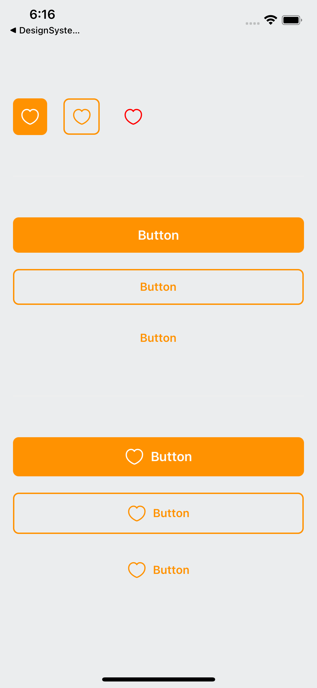

# Button
## 🍀 Preview


## 📍 Example
### Icon Button
```ts
export const Demonstration = {
    render: () => {
        return (
            <Layout orientation="horizontal" spacing={20}>
                <Button iconSrc={Icon} iconColor="white" type="contained" />
                <Button iconSrc={Icon} iconColor="#FF9201" type="outlined" />
                <Button iconSrc={Icon} iconColor="red" type="ghost" />
            </Layout>
        );
    },
};
```
### Text Button
```ts
export const Demonstration = {
    render: () => {
        return (
            <Layout orientation="vertical" spacing={20}>
                <Button text="Button" type="contained" />
                <Button text="Button" type="outlined" textProps={{ color: '#FF9201' }} />
                <Button text="Button" type="ghost" textProps={{ varient: 'body2', color: '#FF9201' }} />
            </Layout>
        );
    },
};
```
### Text and Icon Button
```ts
export const Demonstration = {
    render: () => {
        return (
            <Layout orientation="vertical" spacing={20}>
                <Button text="Button" iconSrc={Icon} iconColor="white" type="contained" />
                <Button text="Button" iconSrc={Icon} iconColor="#FF9201" type="outlined"
                    textProps={{ varient: 'body2', color: '#FF9201' }} />
                <Button text="Button" iconSrc={Icon} iconColor="#FF9201" type="ghost"
                    textProps={{ varient: 'body2', color: '#FF9201', isBold: true }} />
            </Layout>
        );
    },
};
```